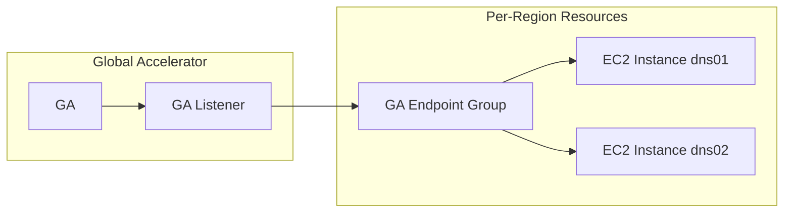

This repo contains terraform configuration to instantiate sets of anycast DNS servers with a test record `hello-world.test. ` We use BIND 9 and AWS Global Accelerator, amazon's anycast service.

 ⚠️ This demo has been updated to avoid a previous use of AWS ELB, and now routes UDP traffic directly from the AWS Global Accelerator to EC2 instances.  For the previous, ELB-dependent topology, see the `ga_to_elb` directory.

# AWS Traffic Flow Configuration

# Show and Tell

A GIF recording is available, below.  Here are the commands used in that show & tell session:

* First you must have terraform installed, and ensure you have AWS credentials setup with adequate permission to create instances, global accelerators, and so on.  I simply used a super-user account.
* `terraform init` to get the working directory ready
* `terraform plan` to do a dry run and see what will happen
* `terraform apply` to deploy your globally-anycasted name servers
* `aws --region us-west-2 globalaccelerator list-accelerators` to show your GA's IP addresses
* `host hello-world.test <IP address of global accelerator>` to run a DNS query against your new server!
*  ⚠️ your first DNS query to the anycast address will probably fail!  It may take 20 minutes for a new Global Accelerator to start functioning.  The animated GIF makes it look quick, but that's Hollywood trickery.
* Try that `host hello-world.test <IP address>` command again after lunch.  It should succeed!
* `terraform destroy` to tear it all down so you won't keep spending money at the rate of $1 per hour

# AWS Cost

As of 2021-11-20 the cost of this is approximately:

| Component                 | Per-Region / Global                  | Cost Range / Region | Cost MRC Ext |
| ------------------------- | ------------------------------------ | ------------------- | ------------ |
| Global Accelerator        | Global                               |                     | $18          |
| DNS Server VMs `t4g.nano` | Capacity-Based Per-Region &times; 17 | $3.03 - $4.83       | $82.11       |

# DDOS Concerns

The speed at which GlobalAccelerator can scale in response to DDOS should be evaluated.

