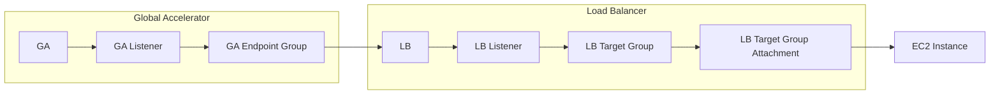

This repo instantiates a set of anycast DNS servers with a test record `hello-world.test.`   We use BIND 9 and AWS Global Accelerator, amazon's anycast service.  The DNS servers are deployed in 17 AWS regions worldwide.

# AWS Traffic Flow Configuration

# Show and Tell

A GIF recording is available, below.  Here are the commands used in that show & tell session:

* First you must have terraform installed, and ensure you have AWS credentials setup with adequate permission to create instances, ELBS, global accelerators, and so on.  I simply used a super-user account.
* `terraform init` to get the working directory ready
* `terraform plan` to do a dry run and see what will happen
* `terraform apply` to deploy your globally-anycasted name servers
* `aws --region us-west-2 globalaccelerator list-accelerators` to show your GA's IP addresses
* `host hello-world.test <IP address of global accelerator>` to run a DNS query against your new server!
*  ⚠️ your first DNS query to the anycast address will probably fail!  It may take 20 minutes for a new Global Accelerator to start functioning.  The animated GIF makes it look quick, but that's Hollywood trickery.
* Try that `host hello-world.test <IP address>` command again after lunch.  It should succeed!
* `terraform destroy` to tear it all down so you won't keep spending money at the rate of $1 per hour

# AWS Cost

As of 2021-11-07 the cost of this is approximately:

| Component                            | Per-Region / Global                  | Cost Range / Region | Cost MRC Ext |
| ------------------------------------ | ------------------------------------ | ------------------- | ------------ |
| Global Accelerator                   | Global                               |                     | $18          |
| Network Load Balancer                | Per-Region                           | $16                 | $275.40      |
| Network Load Balancer Capacity Units | Usage-Based Per-Region               | $4.32               | $73.44       |
| DNS Server VMs `t4g.nano`            | Capacity-Based Per-Region &times; 17 | $3.03 - $4.83       | $82.11       |

# Cost Concerns

An experiment may be required to understand how the cost measurement mechanism for AWS Network Load Balancer (NLB) applies to DNS traffic patterns.

For example, one **Network Load Capacity Unit** (NLCU) is consumed per 50,000 active UDP flows, with some kind of one-minute sampling, and an average over one-hour intervals used to determine that billable consumption.  How long to these flows live?  Can we minimize that time interval through stickiness (session affinity) configuration?  See also the section on DDOS Concerns.

# DDOS Concerns

The speed at which NLB and other services can scale in response to DDOS should be evaluated.

The AWS Network Load Balancer (NLB) may be costly ([AWS ELB pricing link](https://aws.amazon.com/elasticloadbalancing/pricing/)) for a DNS service once DDOS is factored in.  AWS load balancers are billed in NLCU-hours, with one NLCU unit supplying the following UDP resources:

* 400 new UDP flows/second (TCP is 800)
* 50,000 active UDP flows (sampled per minute) (TCP is 100,000 active flows)
* 1 GB / hour traffic to the targets

It seems these values are averaged per hour.  This might mean the cost is tolerable.

